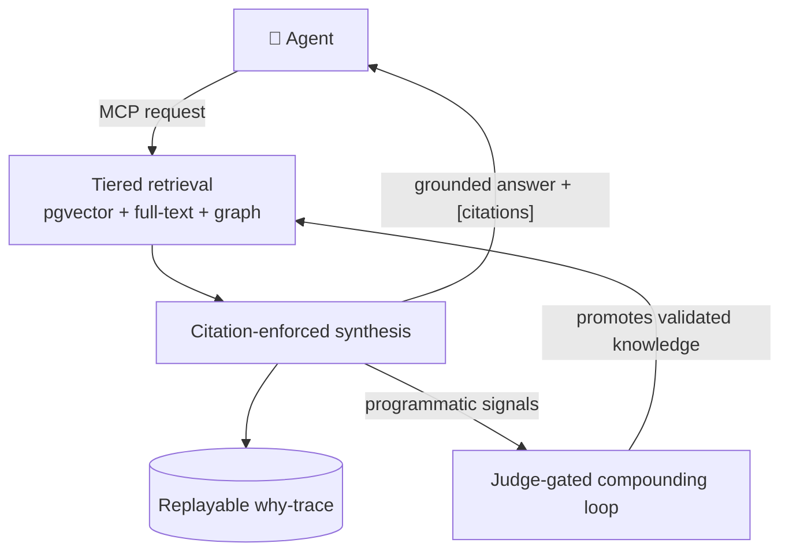

<div align="center">


# AgenticMind

### The auditable, self-improving knowledge & memory layer for AI agents.

Grounded answers with **provable citations**, a full **why-trace** for every answer,
and a corpus that **improves itself** — served to any agent over **MCP**.
**Zero-key, multilingual, and self-hostable on Postgres alone.**

[](https://github.com/Moai-Team-LLC/AgenticMind/actions/workflows/ci.yml)
[](https://www.conventionalcommits.org)
[](LICENSE)
[](https://github.com/Moai-Team-LLC/agentic-product-standard)
[](https://nodejs.org)
[](https://github.com/pgvector/pgvector)
[](https://github.com/Moai-Team-LLC/AgenticMind/stargazers)

**[Quickstart](#-quickstart)** · **[See it work](#-see-it-work)** · **[Agent tools](#-agent-surface-mcp)** · **[How it works](#-how-it-works)** · **[Why](#-why-agenticmind)** · **[The Standard ↗](https://github.com/Moai-Team-LLC/agentic-product-standard)**

<sub>If this is useful, a ⭐ helps others find it — and tells us to keep going.</sub>

</div>

---

> **Not "memory storage for an agent."** AgenticMind is the substrate an agent points
> at when it needs answers it can **trust**, a trail it can **audit**, and a knowledge
> base that **compounds**.

Most agent memory is a vector store with `save()` and `search()`. That buys you fuzzy
recall and zero accountability: you can't tell _why_ an answer came back, whether it's
current, or whether a source even supports it. AgenticMind treats knowledge as a
first-class, auditable, self-improving substrate — and exposes it to any agent over the
Model Context Protocol.

## ✨ Why AgenticMind

- 📌 **Citation-enforced** — every claim in an answer is keyed to a numbered source. No source, no claim.
- 🔍 **Fully auditable** — a replayable _why-trace_ for every answer: what was retrieved, ranked, and used.
- ♻️ **Self-improving** — validated answers are promoted back into the corpus by a judge-gated compounding loop, driven by **programmatic signals** (not human thumbs).
- 🧩 **Tiered retrieval** — chunks → typed fact cards → knowledge graph; hybrid vector + full-text, recency-aware.
- 🔐 **Safe by construction** — scoped, least-privilege MCP tokens, fail-closed auth, guardrails on input _and_ output.
- 🐘 **One datastore** — Postgres + pgvector carries vectors, full-text, the graph (recursive CTE), _and_ the durable queue. No Redis, no Neo4j, no vector-DB sprawl.

## 🔧 How it works



A request comes in over MCP → the engine retrieves across three tiers → synthesises an
answer where **every claim cites a source** → logs a replayable trace → and feeds
programmatic signals into a loop that promotes validated knowledge back into the corpus.

## 🎬 See it work

A real `kl_ask_global` call against a corpus seeded with the Agentic Product Standard. The
question deliberately has **two halves** — one the corpus can answer, one it can't:

<div align="center">
  
</div>

```jsonc
// → kl_ask_global
{ "question": "When should I use a multi-agent architecture instead of a single agent,
                and what must every agent ship with according to the standard?" }

// ← response (trimmed)
{
  "answer": "The provided sources do not specify when to use a multi-agent architecture
             versus a single agent. … According to the Agentic Product Standard, every
             agent must ship with a written Agent Contract [1]. This contract must cover
             ownership, forbidden actions, acceptance criteria, failure modes, escalation
             rules, and logging requirements [1].",
  "citations": [
    { "number": 1, "title": "Agent Contract requirement",
      "materialId": "ba44971b-…", "score": 0.46, "origin": "chunk" }
  ],
  "model": "google/gemini-3.1-flash-lite-preview",
  "retrievalMs": 606, "generationMs": 890,
  "phases": [ {"phase":"embed","ms":552}, {"phase":"retrieve","ms":37},
              {"phase":"synth","ms":890}, {"phase":"output_filter","ms":2} ],
  "telemetryId": "cc942e54-…"
}
```

**Look at what *didn't* happen.** The half the corpus couldn't support, the model **refused to
answer** — *"the provided sources do not specify…"* — instead of fabricating it. The half it
could support is keyed to a numbered citation you can open. And every answer comes with a
**why-trace** (`phases`, `model`, `telemetryId`) you can replay. That's the whole pitch in one
call: **no source, no claim — and a receipt for every answer.**

## 🆚 How it's different

|                         | Plain RAG / memory SDKs | AgenticMind                        |
| ----------------------- | ----------------------- | ---------------------------------- |
| Grounded answers        | sometimes               | citation-enforced + post-checked   |
| Why-trace per answer    | ✗                       | full decision trace                |
| Self-improving corpus   | ✗                       | compounding loop (judge-gated)     |
| Relational verification | ✗                       | graph module                       |
| Runs on                 | varies                  | **Postgres + pgvector** (flagship) |

## ✅ Use it when / 🚫 reach for something else when

**Use AgenticMind when:**

- Your agent must answer **from trusted sources**, and every claim needs a citation.
- You need a **replayable why-trace** and a single `status` (supported / partial /
  unsupported / conflicted / needs_review) you can **gate** an agent on.
- Disagreeing or stale sources must be **surfaced**, not silently resolved.
- You want **governed** self-improvement — not silent autonomous memory mutation.
- You need **self-hosting** (Postgres-only) and **MCP-native** access (Claude Code,
  Cursor, LangGraph, OpenAI/Claude Agent SDK, custom agents).

**Reach for something else when:**

- You only need simple personalised **chat memory** (use a memory SDK).
- You want a **hosted API / no-code UI today** — AgenticMind is self-hosted infra.
- You need **SSO / SOC2** out of the box (see the security model for what exists).
- You're optimising for the **fastest prototype**, not accountable production.

## 🛠 Agent surface (MCP)

A **headless** service (`apps/server`) exposes the engine as MCP tools over
streamable HTTP, with fail-closed per-token bearer auth (scoped, least-privilege):

| Tool                 | Scope              | Purpose                                                             |
| -------------------- | ------------------ | ------------------------------------------------------------------- |
| `kl_search`          | `knowledge:read`   | semantic / keyword passage search                                   |
| `kl_ask_global`      | `knowledge:read`   | synthesised answer + citations + a gate-able `status` (optional `intent`/`facts`) |
| `kl_get_material`    | `knowledge:read`   | fetch a material by id                                              |
| `kl_graph_neighbors` | `knowledge:read`   | related materials via the knowledge graph                           |
| `kl_ingest`          | `knowledge:write`  | add text (chunked, embedded, distilled into cards, graph-extracted) |
| `kl_forget`          | `knowledge:admin`  | delete a material + all derived chunks/cards/graph (inverse of ingest) |
| `kl_signal`          | `knowledge:signal` | emit a programmatic compounding signal on a prior answer            |
| `mem_recall`         | `memory:read`      | recall beliefs (private ∪ shared); semantic or `asOf` time-travel   |
| `mem_write`          | `memory:write`     | record a belief into private memory (bitemporal, revision-aware)    |
| `mem_forget`         | `memory:write`     | retract one of your own beliefs (soft, bitemporal)                  |

See **[What counts as knowledge](docs/knowledge-unit.md)** for the Knowledge Unit
contract (what may become stored knowledge), **[Evals & limits](docs/evals.md)**
for what we measure and **what we don't claim**, **[docs/knobs.md](docs/knobs.md)**
for the optional answer-quality knobs (Tier-B faithfulness, contested-sources,
answer policy, source trust), and the **[security model](docs/security-model.md)**
(fail-closed auth, tenant RLS, lethal-trifecta analysis, supply chain).

There is **no frontend** — the only consumers are agents over MCP. The tool logic is
framework-agnostic in `packages/shared/src/lib/knowledge/mcp-tools.ts`; the host is a
~60-line Web-standard `fetch` handler served by Node or Bun.

## 🚀 Quickstart

### Run it — no clone (~1 min)

Needs Docker (Compose v2.23+) and an OpenAI-compatible key. One command pulls the
published images, generates secrets, brings up Postgres + server + worker, and
prints a ready-to-paste MCP config — **no repo clone, no token minting**:

```bash
OPENAI_API_KEY=sk-... sh -c "$(curl -fsSL https://raw.githubusercontent.com/Moai-Team-LLC/AgenticMind/main/quickstart.sh)"
```

The MCP endpoint comes up at `http://localhost:3000/mcp`, authenticated with a
single static bearer (`MCP_API_KEY`, auto-generated). Point Claude Code / Cursor at
it with the `Authorization: Bearer <MCP_API_KEY>` header.

**Embeddings run locally by default** — a zero-key, offline, multilingual model
(bge-m3) downloads on first use, so retrieval needs no cloud key. Only the
*synthesis* step needs a chat model: `OPENAI_API_KEY` for OpenAI (the default), or
point `CHAT_BASE_URL` at any OpenAI-compatible endpoint — a local Ollama or vLLM.

Prefer to read before you run? Same thing, explicit (just the `deploy/` drop-in, no full clone):

```bash
mkdir agenticmind && cd agenticmind
curl -fsSL https://raw.githubusercontent.com/Moai-Team-LLC/AgenticMind/main/deploy/docker-compose.yml -o docker-compose.yml
curl -fsSL https://raw.githubusercontent.com/Moai-Team-LLC/AgenticMind/main/deploy/.env.example       -o .env.example
curl -fsSL https://raw.githubusercontent.com/Moai-Team-LLC/AgenticMind/main/deploy/gen-secrets.sh     -o gen-secrets.sh && chmod +x gen-secrets.sh
./gen-secrets.sh                   # writes DB password + MCP_API_KEY into .env
# set OPENAI_API_KEY in .env, then:
docker compose up -d
```

### From source (development & contributing)

Requires Docker and **Node ≥22.18** (or **Bun ≥1.3**) — the server and worker run on plain Node or Bun.

```bash
git clone https://github.com/Moai-Team-LLC/AgenticMind.git
cd AgenticMind
cp .env.example .env.local         # set AUTH_SECRET (+ a chat key OR local Ollama)
./setup.sh                         # picks npm or bun, starts Postgres, runs migrations
npm run dev                        # headless MCP server on :3000  (or: bun run dev)
```

Verify the build with `npm run check` (typecheck + tests) — `bun run check` works too.

In a from-source dev setup the `/mcp` route is fail-closed and accepts a bearer
`typ="mcp"` HS256 JWT (rather than the static deploy key). The headless server
ships no admin UI — mint one with the issuance script (it reads `DATABASE_URL` +
`AUTH_SECRET` from your `.env.local`):

```bash
npm run issue-token -- --label "claude-code" --ttl-days 365   # or: bun run issue-token --label …
# prints the bearer on the last line — capture it, it is not stored in plaintext
```

Then point an MCP client at `http://localhost:3000/mcp` with that token as the
`Authorization: Bearer …` header. (Lint additionally requires Node ≥22.18 — see `.nvmrc`.)

> **Note.** The local Docker Postgres has no TLS, so `.env.example` ships
> `DATABASE_SSL=false` and `DATABASE_URL` on host port `5435`. For managed Postgres
> (Supabase, RDS, …) that requires SSL, set `DATABASE_SSL=true`.

## 🧱 Layout

```text
packages/shared/src/lib/knowledge/        ← the tiered engine (the product)
packages/shared/src/lib/ai/               ← chat + embeddings (provider-agnostic; local embeddings by default)
packages/shared/src/database/             ← Drizzle schema + queries (Postgres + pgvector)
apps/server/src/{index,mcp}.ts            ← headless MCP host, Node or Bun (agent surface)
apps/worker/src/jobs/knowledge-feedback/  ← Postgres-scheduled compounding sweep
```

**Architecture notes.** Agent-first and **Postgres-only**: the graph lives behind a
`GraphStore` interface (recursive-CTE traversal on Postgres, no extra service),
compounding is driven by programmatic signals, MCP tokens are scoped least-privilege, the
agent principal is slim, and the host is a headless Node/Bun HTTP server. Retrieval is **multilingual by
default** — local `bge-m3` embeddings cover many languages with zero keys; full-text search
uses the language-agnostic `simple` config (configurable per deployment).

## 🌐 Ecosystem

AgenticMind is the flagship **reference implementation** of
**[the Agentic Product Standard](https://github.com/Moai-Team-LLC/agentic-product-standard)** —
the open standard (plus Claude Code skills) for building production-grade agentic products.

|     | Repo                                                                                    | Use it when                                                                                         |
| --- | --------------------------------------------------------------------------------------- | --------------------------------------------------------------------------------------------------- |
| 📐  | **[agentic-product-standard](https://github.com/Moai-Team-LLC/agentic-product-standard)** | You're **designing or building** an agent / agentic product — the standard + skills tell you _how_. |
| 🧠  | **AgenticMind** (this repo)                                                             | You need a **knowledge & memory layer** for your agent — a working implementation you can run.      |
| 🚦  | **[AgenticOps](https://github.com/Moai-Team-LLC/AgenticOps)**                             | You're **running a fleet** — manifests, backlog, scheduler, telemetry, and policy for agent operations. |
| 🩺  | **[AgenticSelfHealingCode](https://github.com/Moai-Team-LLC/AgenticSelfHealingCode)**     | Your product needs **self-healing ops** — incident diagnosis (RCA copilot), test-suite healing, outcome-earned autonomy. |
| 📊  | **Agent Performance Layer (APL)** — public release in progress                            | You need **observability & evals** — OTel traces, golden-set evals, failure clusters.               |

See the standard's [AgenticMind case study](https://github.com/Moai-Team-LLC/agentic-product-standard/blob/main/examples/agenticmind-case-study.md) for a layer-by-layer map of how this repo implements the canon.

## 🤝 Contributing & license

Contributions welcome — see [`CONTRIBUTING.md`](CONTRIBUTING.md). Licensed under [Apache-2.0](LICENSE).
