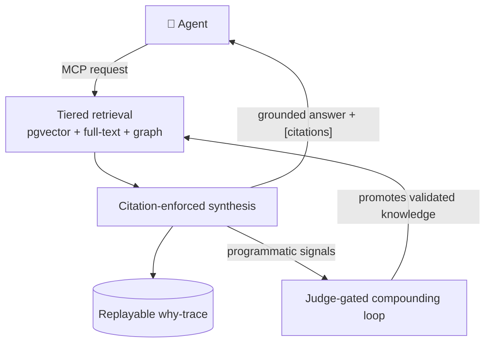

<div align="center">

# 🧠 AgenticMind

### The auditable, self-improving knowledge & memory layer for AI agents.

Grounded answers with **provable citations**, a full **why-trace** for every answer,
and a corpus that **improves itself** — served to any agent over **MCP**.

[](LICENSE)
[](https://github.com/AlexDuchDev/agentic-product-standard)
[](https://bun.sh)
[](https://github.com/pgvector/pgvector)
[](CONTRIBUTING.md)

**[Quickstart](#-quickstart)** · **[Agent tools](#-agent-surface-mcp)** · **[How it works](#-how-it-works)** · **[Why](#-why-agenticmind)** · **[The Standard ↗](https://github.com/AlexDuchDev/agentic-product-standard)**

</div>

---

> **Not "memory storage for an agent."** AgenticMind is the substrate an agent points
> at when it needs answers it can **trust**, a trail it can **audit**, and a knowledge
> base that **compounds**.

Most agent memory is a vector store with `save()` and `search()`. That buys you fuzzy
recall and zero accountability: you can't tell *why* an answer came back, whether it's
current, or whether a source even supports it. AgenticMind treats knowledge as a
first-class, auditable, self-improving substrate — and exposes it to any agent over the
Model Context Protocol.

## ✨ Why AgenticMind

- 📌 **Citation-enforced** — every claim in an answer is keyed to a numbered source. No source, no claim.
- 🔍 **Fully auditable** — a replayable *why-trace* for every answer: what was retrieved, ranked, and used.
- ♻️ **Self-improving** — validated answers are promoted back into the corpus by a judge-gated compounding loop, driven by **programmatic signals** (not human thumbs).
- 🧩 **Tiered retrieval** — chunks → typed fact cards → knowledge graph; hybrid vector + full-text, recency-aware.
- 🔐 **Safe by construction** — scoped, least-privilege MCP tokens, fail-closed auth, guardrails on input *and* output.
- 🐘 **One datastore** — Postgres + pgvector carries vectors, full-text, the graph (recursive CTE), *and* the durable queue. No Redis, no Neo4j, no vector-DB sprawl.

## 🔧 How it works



A request comes in over MCP → the engine retrieves across three tiers → synthesises an
answer where **every claim cites a source** → logs a replayable trace → and feeds
programmatic signals into a loop that promotes validated knowledge back into the corpus.

## 🆚 How it's different

| | Plain RAG / memory SDKs | AgenticMind |
|---|---|---|
| Grounded answers | sometimes | citation-enforced + post-checked |
| Why-trace per answer | ✗ | full decision trace |
| Self-improving corpus | ✗ | compounding loop (judge-gated) |
| Relational verification | ✗ | graph module |
| Runs on | varies | **Postgres + pgvector** (flagship) |

## 🛠 Agent surface (MCP)

A **headless** Bun service (`apps/server`) exposes the engine as MCP tools over
streamable HTTP, with fail-closed per-token bearer auth (scoped, least-privilege):

| Tool | Scope | Purpose |
|---|---|---|
| `kl_search` | `knowledge:read` | semantic / keyword passage search |
| `kl_ask_global` | `knowledge:read` | synthesised answer + citations (optional `intent`/`facts`) |
| `kl_get_material` | `knowledge:read` | fetch a material by id |
| `kl_graph_neighbors` | `knowledge:read` | related materials via the knowledge graph |
| `kl_ingest` | `knowledge:write` | add text (chunked, embedded, distilled into cards, graph-extracted) |
| `kl_signal` | `knowledge:signal` | emit a programmatic compounding signal on a prior answer |
| `mem_recall` | `memory:read` | recall beliefs (private ∪ shared); semantic or `asOf` time-travel |
| `mem_write` | `memory:write` | record a belief into private memory (bitemporal, revision-aware) |

There is **no frontend** — the only consumers are agents over MCP. The tool logic is
framework-agnostic in `packages/shared/src/lib/knowledge/mcp-tools.ts`; the host is
~60 lines of `Bun.serve`.

## 🚀 Quickstart

Requires [Bun](https://bun.sh) ≥1.3 and Docker (for Postgres + pgvector).

```bash
git clone https://github.com/AlexDuchDev/AgenticMind.git
cd AgenticMind
cp .env.example .env.local         # then set OPENROUTER_API_KEY + AUTH_SECRET
./setup.sh                         # installs deps, starts Postgres, runs migrations
bun run dev                        # headless MCP server on :3000
```

Verify the build with `bun run check` (typecheck + tests). Point an MCP client at
`http://localhost:3000/mcp` with a bearer `typ="mcp"` JWT. (Lint additionally requires
Node ≥22.18 — see `.nvmrc`.)

## 🧱 Layout

```text
packages/shared/src/lib/knowledge/        ← the tiered engine (the product)
packages/shared/src/lib/ai/               ← LLM + embeddings (OpenRouter)
packages/shared/src/database/             ← Drizzle schema + queries (Postgres + pgvector)
apps/server/src/{index,mcp}.ts            ← headless Bun MCP host (agent surface)
apps/worker/src/jobs/knowledge-feedback/  ← Postgres-scheduled compounding sweep
```

**Architecture notes.** Agent-first and **Postgres-only**: the graph lives behind a
`GraphStore` interface (recursive-CTE traversal on Postgres, no extra service),
compounding is driven by programmatic signals, MCP tokens are scoped least-privilege, the
agent principal is slim, and the host is headless Bun. The knowledge engine is
English-language (`simple` + `english` full-text configs alongside pgvector embeddings).

## 🌐 Ecosystem

AgenticMind is the flagship **reference implementation** of
**[the Agentic Product Standard](https://github.com/AlexDuchDev/agentic-product-standard)** —
the open standard (plus Claude Code skills) for building production-grade agentic products.

| | Repo | Use it when |
|---|---|---|
| 📐 | **[agentic-product-standard](https://github.com/AlexDuchDev/agentic-product-standard)** | You're **designing or building** an agent / agentic product — the standard + skills tell you *how*. |
| 🧠 | **AgenticMind** (this repo) | You need a **knowledge & memory layer** for your agent — a working implementation you can run. |

See the standard's [AgenticMind case study](https://github.com/AlexDuchDev/agentic-product-standard/blob/main/examples/agenticmind-case-study.md) for a layer-by-layer map of how this repo implements the canon.

## 🤝 Contributing & license

Contributions welcome — see [`CONTRIBUTING.md`](CONTRIBUTING.md). Licensed under [Apache-2.0](LICENSE).
